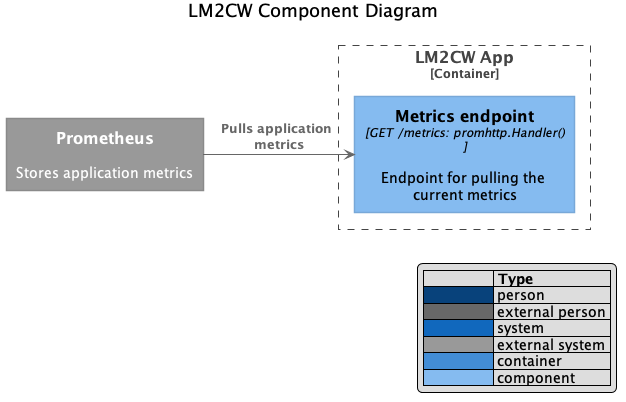

# LogicMonitor 2 Connectwise (LM2CW)

This service is responsible for adding/synchronizing devices in LogicMonitor to Connectwise.The service runs at defined interval, But can also be triggered manually for synchronizing devices.

 

## Synchronizing devices

The synchronizing of devices from logicmonitor to connectwise happens in two ways.

1. Automatic synching with cron in defined intervals. Currently the interval is set to 180 minutes.
2. Manually triggering the endpoint responsible for synchronizing devices.

The device synchronization
1. Gets all devices from logicmonitor.
2. Parse the devices to be used in connectwise.
3. Add or update those device in connectwise.
